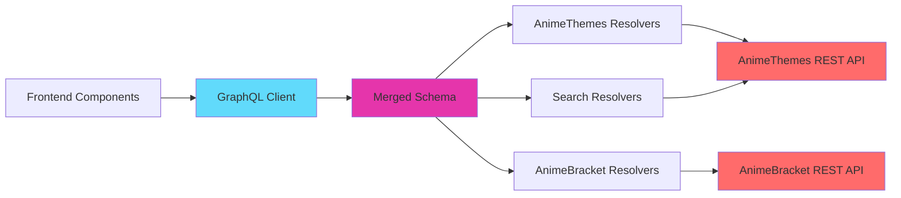
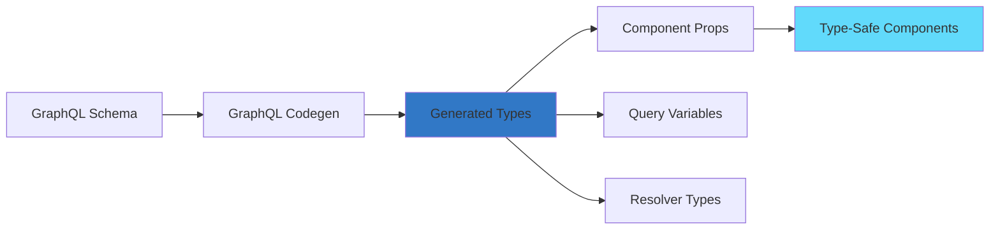

## Overview

AnimeThemes Web uses a **merged GraphQL schema** that combines multiple data sources into a unified API. This allows the frontend to query different backends (AnimeThemes API and AnimeBracket API) through a single GraphQL interface.

## Architecture



## Schema Merging

### Server-Side Schema

The server schema combines AnimeThemes and AnimeBracket type definitions:

```typescript:src/lib/server/index.ts
import { mergeResolvers, mergeTypeDefs } from "@graphql-tools/merge";
import { makeExecutableSchema } from "@graphql-tools/schema";

import resolversAnimeThemes from "@/lib/common/animethemes/resolvers";
import typeDefsAnimeThemes from "@/lib/common/animethemes/type-defs";
import resolversAnimeBracket from "@/lib/server/animebracket/resolvers";
import typeDefsAnimeBracket from "@/lib/server/animebracket/type-defs";

export const schema = makeExecutableSchema({
    typeDefs: mergeTypeDefs([typeDefsAnimeThemes, typeDefsAnimeBracket]),
    resolvers: mergeResolvers([resolversAnimeThemes, resolversAnimeBracket]),
});

export const fetchData = buildFetchData(schema);
```

### Type Definitions

Type definitions are defined using `graphql-tag`:

<Tabs>
  <Tab title="AnimeThemes Types">
    ```typescript:src/lib/common/animethemes/type-defs.ts
    import gql from "graphql-tag";

    export default gql`
        type Query {
            anime(slug: String!): Anime
            animeAll: [Anime!]!
            artist(slug: String!): Artist
            artistAll: [Artist!]!
            video(basename: String!): Video
            videoAll(limit: Int, orderBy: String, orderDesc: Boolean): [Video!]!
            featuredTheme: FeaturedTheme
            announcementAll: [Announcement!]!
        }

        type Anime {
            id: Int!
            slug: String!
            name: String!
            year: Int!
            season: String
            media_format: String
            synopsis: String
            synonyms: [Synonym!]!
            themes: [Theme!]!
            series: [Series!]!
            studios: [Studio!]!
            resources: [Resource!]!
            images: [Image!]!
        }

        type Theme {
            id: Int!
            type: String!
            sequence: Int
            group: Group
            anime: Anime!
            song: Song
            entries: [Entry!]!
        }

        type Entry {
            id: Int!
            version: Int
            episodes: String
            spoiler: Boolean!
            nsfw: Boolean!
            videos: [Video!]!
            theme: Theme!
        }

        type Video {
            id: Int!
            basename: String!
            filename: String!
            path: String!
            size: Int!
            resolution: Int
            nc: Boolean!
            subbed: Boolean!
            lyrics: Boolean!
            uncen: Boolean!
            source: String
            overlap: String
            tags: String!
            audio: Audio
            script: VideoScript
            entries: [Entry!]!
        }

        type Artist {
            id: Int!
            slug: String!
            name: String!
            performances: [Song!]!
            members: [Artist!]!
            groups: [Artist!]!
            resources: [Resource!]!
            images: [Image!]!
        }

        type Song {
            id: Int!
            title: String
            themes: [Theme!]!
            performances: [Artist!]!
        }

        # ... more types
    `;
    ```
  </Tab>
  
  <Tab title="AnimeBracket Types">
    ```typescript:src/lib/server/animebracket/type-defs.ts
    import gql from "graphql-tag";

    export default gql`
        extend type Query {
            bracket(slug: String!): Bracket
            bracketAll: [Bracket!]!
        }

        type Bracket {
            id: Int!
            slug: String!
            name: String!
            currentRound: Int
            rounds: [BracketRound!]!
        }

        type BracketRound {
            tier: Int!
            name: String!
            pairings: [BracketPairing!]!
        }

        type BracketPairing {
            order: Int!
            characterA: BracketCharacter!
            characterB: BracketCharacter!
            votesA: Int!
            votesB: Int!
        }

        type BracketCharacter {
            id: Int!
            name: String!
            source: String!
            seed: Int!
            theme: Theme
        }
    `;
    ```
  </Tab>
  
  <Tab title="Search Types">
    ```typescript:src/lib/client/search.ts
    export const searchTypeDefs = gql`
        type Query {
            search(args: SearchArgs!): GlobalSearchResult!
            searchAnime(args: SearchArgs!): AnimeSearchResult!
            searchTheme(args: SearchArgs!): ThemeSearchResult!
            searchArtist(args: SearchArgs!): ArtistSearchResult!
            searchSeries(args: SearchArgs!): SeriesSearchResult!
            searchStudio(args: SearchArgs!): StudioSearchResult!
            searchPlaylist(args: SearchArgs!): PlaylistSearchResult!
        }

        type GlobalSearchResult {
            anime: [Anime!]!
            themes: [Theme!]!
            artists: [Artist!]!
            series: [Series!]!
            studios: [Studio!]!
            playlists: [Playlist!]!
        }

        input SearchArgs {
            query: String
            filters: [Filter!]
            sortBy: String
            page: Int
        }

        input Filter {
            key: String!
            value: String
        }

        interface EntitySearchResult {
            nextPage: Int
        }

        type AnimeSearchResult implements EntitySearchResult {
            data: [Anime!]!
            nextPage: Int
        }
    `;
    ```
  </Tab>
</Tabs>

## Resolvers

### API Resolver Factory

A custom resolver factory bridges GraphQL with REST APIs:

```typescript:src/lib/common/animethemes/api.ts
export function createApiResolver<ApiResponse>() {
    return function createApiResolverCurried<ApiResource, Parent, Args>(
        config: ApiResolverConfig<ApiResponse, ApiResource, Parent, Args>,
    ) {
        return async (parent: Parent, args: Args, context: ApiResolverContext, info: GraphQLResolveInfo) => {
            // Try to extract from parent first (if already fetched)
            if (config.extractFromParent) {
                const extracted = config.extractFromParent(parent, args);
                if (extracted !== undefined) {
                    return extracted;
                }
            }

            // Build API request URL with smart includes
            const { url, headers } = buildRequest(config, parent, args, context, info);

            // Fetch from API (with concurrency limiting)
            return limit(() => fetchResults(url, headers, config, parent, args, context));
        };
    };
}
```

### Smart Include System

Resolvers automatically determine which related data to include based on the GraphQL query:

```typescript:src/lib/common/animethemes/api.ts
export const INCLUDES = {
    Anime: {
        synonyms: "animesynonyms",
        themes: "animethemes",
        series: "series",
        studios: "studios",
        resources: "resources",
        images: "images",
    },
    Theme: {
        song: "song",
        group: "group",
        anime: "anime",
        entries: "animethemeentries",
    },
    Entry: {
        videos: "videos",
        theme: "animetheme",
    },
    Video: {
        audio: "audio",
        script: "videoscript",
        entries: "animethemeentries",
    },
};

const ALLOWED_INCLUDES: Record<string, Array<string>> = {
    Anime: [
        "animesynonyms",
        "series",
        "animethemes.song.artists",
        "animethemes.animethemeentries.videos.audio",
        "images",
        "resources",
        "studios.images",
    ],
};

function getIncludes(info: GraphQLResolveInfo, baseInclude?: string) {
    const infoFragment = parseResolveInfo(info);
    return getIncludesRecursive(infoFragment, baseInclude ? baseInclude + "." : "");
}
```

**How it works:**

<Steps>
  <Step title="Parse Query">
    Analyzes the GraphQL query to determine which fields are requested
  </Step>
  
  <Step title="Map to Includes">
    Maps GraphQL fields to API include parameters
  </Step>
  
  <Step title="Filter Allowed">
    Removes includes not supported by the API
  </Step>
  
  <Step title="Optimize">
    Removes redundant includes (e.g., if `anime.themes.song` is included, `anime.themes` is redundant)
  </Step>
  
  <Step title="Build URL">
    Appends includes to API request: `?include=animethemes.song,images`
  </Step>
</Steps>

## Code Generation

TypeScript types are generated from GraphQL schemas:

```typescript:codegen.ts
import type { CodegenConfig } from "@graphql-codegen/cli";

const config: CodegenConfig = {
    schema: [
        "src/lib/common/animethemes/type-defs.ts",
        "src/lib/server/animebracket/type-defs.ts",
        "src/lib/client/search.ts",
    ],
    documents: ["src/**/*.js", "src/**/*.ts", "src/**/*.tsx"],
    generates: {
        "src/generated/graphql.ts": {
            plugins: ["typescript", "typescript-operations"],
            config: {
                avoidOptionals: { object: true, field: true },
                enumsAsTypes: true,
                skipTypename: true,
                useTypeImports: true,
            },
        },
        "src/generated/graphql-resolvers.ts": {
            plugins: ["typescript", "typescript-resolvers"],
            config: {
                useTypeImports: true,
                mappers: {
                    Anime: "@/lib/common/animethemes/types#ApiAnime",
                    Artist: "@/lib/common/animethemes/types#ApiArtist",
                    Video: "@/lib/common/animethemes/types#ApiVideo",
                    // ... more type mappers
                },
            },
        },
    },
};
```

## Query Examples

### Fragment-Based Queries

Components define GraphQL fragments for their data requirements:

```typescript:src/pages/anime/[animeSlug]/index.tsx
AnimeDetailPage.fragments = {
    anime: gql`
        ${extractImages.fragments.resourceWithImages}
        ${ThemeDetailCard.fragments.theme}

        fragment AnimeDetailPageAnime on Anime {
            ...extractImagesResourceWithImages
            slug
            name
            season
            year
            synopsis
            media_format
            synonyms {
                text
            }
            series {
                slug
                name
            }
            studios {
                slug
                name
            }
            resources {
                site
                link
                as
            }
            themes {
                ...ThemeDetailCardTheme
            }
        }
    `,
};

export const getStaticProps: GetStaticProps = async ({ params }) => {
    const { data } = await fetchData<AnimeDetailPageQuery>(
        gql`
            ${AnimeDetailPage.fragments.anime}

            query AnimeDetailPage($animeSlug: String!) {
                anime(slug: $animeSlug) {
                    ...AnimeDetailPageAnime
                }
            }
        `,
        params,
    );

    return {
        props: { anime: data.anime },
        revalidate: 3600,
    };
};
```

### Client-Side Queries

React components use React Query for client-side data fetching:

```typescript:src/components/home/RecentlyAddedVideos.tsx
import { useQuery } from "@tanstack/react-query";
import gql from "graphql-tag";
import { fetchDataClient } from "@/lib/client";

export function RecentlyAddedVideos() {
    const { data: recentlyAdded } = useQuery({
        queryKey: ["HomePageRecentlyAdded"],
        queryFn: async () => {
            const { data } = await fetchDataClient<HomePageRecentlyAddedQuery>(gql`
                query HomePageRecentlyAdded {
                    videoAll(orderBy: "id", orderDesc: true, limit: 10) {
                        ...VideoSummaryCardVideo
                        entries {
                            ...VideoSummaryCardEntry
                        }
                    }
                }
            `);

            return data.videoAll;
        },
        placeholderData: range(10).map(() => null),
    });

    return (
        <Column>
            {recentlyAdded?.map((video, index) => (
                <VideoSummaryCard key={index} video={video} entry={video.entries[0]} />
            ))}
        </Column>
    );
}
```

### Search Queries

```typescript:src/lib/client/search.ts
export const searchResolvers: Resolvers = {
    Query: {
        search: async (_, { args }) => {
            const searchParams = getSearchParams(args, true);
            
            searchParams.append(
                "include[anime]",
                "animethemes.animethemeentries.videos,images"
            );
            searchParams.append(
                "include[animetheme]",
                "animethemeentries.videos.audio,anime.images,song.artists"
            );
            
            const result = await fetchJson<GlobalSearchResult>(
                `/search?${searchParams}`
            );

            return {
                anime: result.search.anime,
                themes: result.search.animethemes,
                artists: result.search.artists,
                series: result.search.series,
                studios: result.search.studios,
                playlists: result.search.playlists,
            };
        },
    },
};
```

## Performance Optimizations

<CardGroup cols={2}>
  <Card title="Concurrency Limiting" icon="gauge">
    ```typescript
    import pLimit from "p-limit";
    const limit = pLimit(5);
    
    return limit(() => fetchResults(url, headers, config));
    ```
    Prevents timeouts by limiting concurrent API requests to 5
  </Card>
  
  <Card title="Request Caching" icon="database">
    ```typescript
    const jsonCached = context?.cache?.get(url);
    if (jsonCached) {
        return jsonCached;
    }
    
    const json = await fetchJson(url, { headers });
    context.cache?.set(url, json);
    ```
    Caches identical requests within the same page generation
  </Card>
  
  <Card title="Build-Time Caching" icon="bolt">
    ```typescript
    const buildTimeCache: Map<string, AnimeDetailPageQuery> = new Map();
    
    data.animeAll.forEach((anime) => {
        buildTimeCache.set(anime.slug, { anime });
    });
    ```
    Pages cache data from `getStaticPaths` for reuse in `getStaticProps`
  </Card>
  
  <Card title="Smart Field Selection" icon="filter">
    ```typescript
    searchParams.append(
        "fields[anime]",
        "id,name,slug,year,season,media_format"
    );
    ```
    Only requests fields that are actually needed
  </Card>
</CardGroup>

## Error Handling

```typescript:src/lib/common/animethemes/api.ts
export async function fetchJson<T>(path: string, config: RequestInit = {}): Promise<T | null> {
    const url = path.startsWith(API_URL) ? path : `${API_URL}${path}`;
    const response = await fetch(url, config);

    if (!response.ok) {
        // Return null for expected errors (not found, unauthorized)
        if (response.status === 404 || response.status === 401 || response.status === 403) {
            return null;
        }

        // Throw for unexpected errors
        throw new Error(
            `API returned with non-ok status code: ${response.status} (${response.statusText}) for ${url}.`
        );
    }

    try {
        return await response.json();
    } catch {
        throw new Error(`API returned invalid JSON for ${url}.`);
    }
}
```

## Type Safety Flow



## Best Practices

<AccordionGroup>
  <Accordion title="Define Fragments in Components">
    Co-locate data requirements with the components that use them:
    
    ```typescript
    Component.fragments = {
        data: gql`fragment ComponentData on Type { field1 field2 }`
    };
    ```
  </Accordion>
  
  <Accordion title="Use Type Imports">
    Import generated types for type safety:
    
    ```typescript
    import type { AnimeDetailPageQuery } from "@/generated/graphql";
    ```
  </Accordion>
  
  <Accordion title="Leverage Smart Includes">
    Let the resolver system automatically determine includes instead of manually specifying them
  </Accordion>
  
  <Accordion title="Cache Within Context">
    Use the context cache to avoid duplicate requests in the same operation
  </Accordion>
</AccordionGroup>
