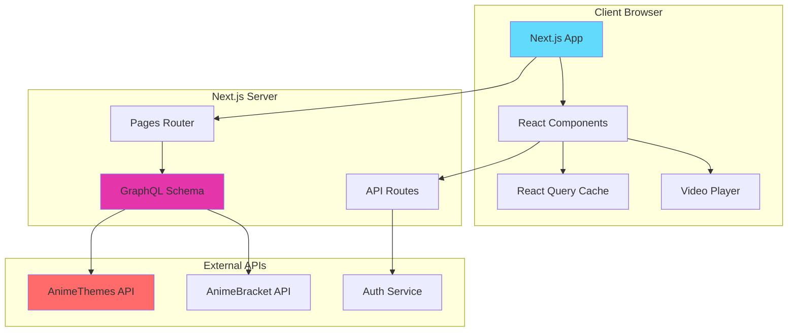
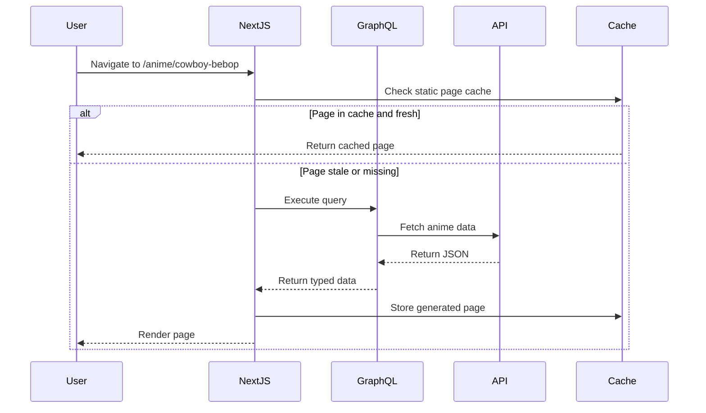

## Introduction

AnimeThemes Web is a Next.js application built with the **Pages Router** architecture. The project serves as a frontend for browsing anime opening and ending themes, providing static generation for optimal performance while supporting dynamic user interactions.

## Technology Stack

<CardGroup cols={2}>
  <Card title="Framework" icon="react">
    - **Next.js 15** with Pages Router
    - **React 19** for UI components
    - **TypeScript** for type safety
  </Card>
  
  <Card title="Styling" icon="paintbrush">
    - **styled-components** for component styling
    - **Sass** for global styles
    - Custom theme system with dark mode
  </Card>
  
  <Card title="Data Layer" icon="database">
    - **GraphQL** with schema merging
    - **@tanstack/react-query** for client state
    - **SWR** for authentication state
  </Card>
  
  <Card title="Build & Deploy" icon="rocket">
    - Static Site Generation (SSG)
    - Incremental Static Regeneration (ISR)
    - Server-Side Rendering (SSR) where needed
  </Card>
</CardGroup>

## Architecture Diagram



## Project Structure

The codebase follows a feature-based organization within a standard Next.js structure:

<Accordion title="Directory Structure">
```
src/
├── pages/                 # Next.js Pages Router
│   ├── _app.tsx          # Application wrapper
│   ├── _document.tsx     # HTML document structure
│   ├── index.tsx         # Homepage
│   ├── anime/            # Anime pages
│   │   ├── [animeSlug]/
│   │   │   ├── index.tsx
│   │   │   └── [videoSlug]/
│   │   └── index.tsx
│   ├── artist/           # Artist pages
│   ├── search/           # Search pages
│   └── api/              # API routes
├── components/           # React components
│   ├── card/
│   ├── dialog/
│   ├── navigation/
│   └── video-player/
├── lib/                  # Core logic
│   ├── client/           # Client-side utilities
│   ├── common/           # Shared code
│   └── server/           # Server-side logic
├── hooks/                # Custom React hooks
├── context/              # React Context providers
├── generated/            # GraphQL generated types
├── styles/               # Global styles
├── theme/                # Theme configuration
└── utils/                # Helper functions
```
</Accordion>

## Key Architectural Patterns

### 1. Static Site Generation (SSG)

The application heavily leverages SSG for performance:

```typescript:src/pages/anime/[animeSlug]/index.tsx
export const getStaticProps: GetStaticProps<AnimeDetailPageProps> = async ({ params }) => {
    const { data, apiRequests } = await fetchData<AnimeDetailPageQuery>(
        gql`
            query AnimeDetailPage($animeSlug: String!) {
                anime(slug: $animeSlug) {
                    ...AnimeDetailPageAnime
                }
            }
        `,
        params,
    );

    return {
        props: {
            ...getSharedPageProps(apiRequests),
            anime: data.anime,
        },
        // Revalidate after 1 hour
        revalidate: 3600,
    };
};
```

### 2. GraphQL Schema Merging

Multiple GraphQL APIs are merged into a unified schema:

```typescript:src/lib/server/index.ts
import { mergeResolvers, mergeTypeDefs } from "@graphql-tools/merge";
import { makeExecutableSchema } from "@graphql-tools/schema";

export const schema = makeExecutableSchema({
    typeDefs: mergeTypeDefs([typeDefsAnimeThemes, typeDefsAnimeBracket]),
    resolvers: mergeResolvers([resolversAnimeThemes, resolversAnimeBracket]),
});

export const fetchData = buildFetchData(schema);
```

### 3. Context-Based State Management

The app uses React Context for global state:

<Tabs>
  <Tab title="Player Context">
    ```typescript:src/context/playerContext.ts
    interface PlayerContextInterface {
        watchList: WatchListItem[];
        setWatchList: (watchList: WatchListItem[]) => void;
        currentWatchListItem: WatchListItem | null;
        isGlobalAutoPlay: boolean;
        setGlobalAutoPlay: (autoPlay: boolean) => void;
        isRepeat: boolean;
        setRepeat: (repeat: boolean) => void;
    }
    ```
  </Tab>
  
  <Tab title="Theme Context">
    ```typescript
    interface ColorThemeContextInterface {
        colorTheme: ColorTheme;
        setColorTheme: (theme: ColorTheme) => void;
    }
    ```
  </Tab>
  
  <Tab title="Toast Context">
    ```typescript
    interface ToastContextInterface {
        showToast: (message: string, type: ToastType) => void;
        hideToast: (id: string) => void;
    }
    ```
  </Tab>
</Tabs>

## Rendering Strategies

The application uses different rendering strategies based on page requirements:

| Page Type | Strategy | Reason |
|-----------|----------|--------|
| Anime Detail | SSG + ISR | Content changes infrequently, revalidate hourly |
| Artist Detail | SSG + ISR | Static content with periodic updates |
| Search | CSR | Highly dynamic, user-specific queries |
| Homepage | SSG | Featured content, regenerated on build |
| User Profile | SSR | User-specific, requires authentication |

## Data Flow



## Performance Optimizations

<CardGroup cols={2}>
  <Card title="Build-Time Caching" icon="bolt">
    Pages cache API responses during build to avoid redundant requests:
    ```typescript
    const buildTimeCache: Map<string, AnimeDetailPageQuery> = new Map();
    ```
  </Card>
  
  <Card title="Concurrent Limiting" icon="gauge">
    API requests are limited to prevent timeouts:
    ```typescript
    const limit = pLimit(5);
    ```
  </Card>
  
  <Card title="Smart Includes" icon="network-wired">
    GraphQL automatically determines required API includes based on query fields
  </Card>
  
  <Card title="ISR Revalidation" icon="clock">
    Pages revalidate after 1 hour (3600 seconds) to balance freshness and performance
  </Card>
</CardGroup>

## Configuration

Key configuration in `next.config.ts`:

```typescript:next.config.ts
const nextConfig: NextConfig = {
    reactStrictMode: true,
    compiler: {
        styledComponents: true,
    },
    staticPageGenerationTimeout: 3600,
    experimental: {
        // Single-threaded for caching between page builds
        workerThreads: false,
        cpus: 1,
    },
};
```

## Next Steps

<CardGroup cols={2}>
  <Card title="Pages & Routing" href="/architecture/pages-routing" icon="route">
    Learn about the Pages Router structure and dynamic routes
  </Card>
  
  <Card title="GraphQL Layer" href="/architecture/graphql-layer" icon="diagram-project">
    Understand the GraphQL implementation and schema merging
  </Card>
  
  <Card title="State Management" href="/architecture/state-management" icon="database">
    Explore React Query, SWR, and context-based state
  </Card>
</CardGroup>
