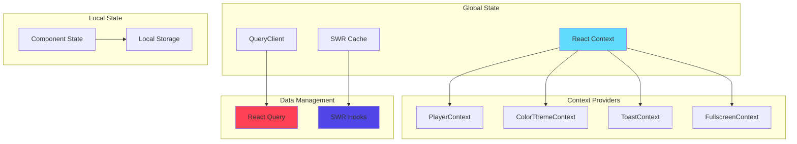
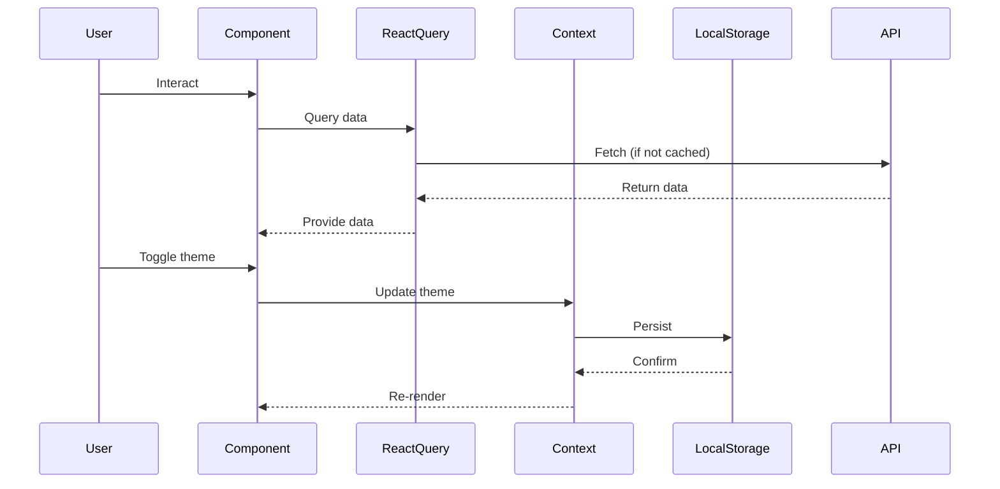

## Overview

AnimeThemes Web uses a **multi-layered state management approach**, combining different tools for different types of state:

<CardGroup cols={3}>
  <Card title="React Query" icon="database">
    Server state for data fetching and caching
  </Card>
  
  <Card title="SWR" icon="sync">
    Authentication state with automatic revalidation
  </Card>
  
  <Card title="React Context" icon="layer-group">
    Global UI state (player, theme, toasts)
  </Card>
</CardGroup>

## State Architecture



## React Query (@tanstack/react-query)

### Setup

React Query is initialized in `_app.tsx`:

```typescript:src/pages/_app.tsx
import { QueryClient, QueryClientProvider } from "@tanstack/react-query";

const queryClient = new QueryClient();

export default function MyApp({ Component, pageProps }: AppProps) {
    return (
        <QueryClientProvider client={queryClient}>
            <Component {...pageProps} />
        </QueryClientProvider>
    );
}
```

### Usage Pattern

Components use `useQuery` for data fetching:

<Tabs>
  <Tab title="Recently Added Videos">
    ```typescript:src/components/home/RecentlyAddedVideos.tsx
    import { useQuery } from "@tanstack/react-query";
    import gql from "graphql-tag";
    import { fetchDataClient } from "@/lib/client";

    export function RecentlyAddedVideos() {
        const { data: recentlyAdded } = useQuery<
            HomePageRecentlyAddedQuery["videoAll"] | Array<null>
        >({
            queryKey: ["HomePageRecentlyAdded"],
            queryFn: async () => {
                const { data } = await fetchDataClient<HomePageRecentlyAddedQuery>(gql`
                    query HomePageRecentlyAdded {
                        videoAll(orderBy: "id", orderDesc: true, limit: 10) {
                            ...VideoSummaryCardVideo
                            entries {
                                ...VideoSummaryCardEntry
                            }
                        }
                    }
                `);

                return data.videoAll;
            },
            placeholderData: range(10).map(() => null),
        });

        return (
            <Column style={{ "--gap": "16px" }}>
                {recentlyAdded?.map((video, index) => (
                    <Skeleton key={index} variant="summary-card" delay={index * 100}>
                        {video ? <VideoSummaryCard video={video} entry={video.entries[0]} /> : null}
                    </Skeleton>
                ))}
            </Column>
        );
    }
    ```
  </Tab>
  
  <Tab title="Search Results">
    ```typescript:src/pages/search/index.tsx
    import { useQuery } from "@tanstack/react-query";
    
    export default function SearchPage() {
        const [searchQuery, setSearchQuery] = useState("");
        
        const { data: results, isLoading } = useQuery({
            queryKey: ["search", searchQuery],
            queryFn: async () => {
                const { data } = await fetchDataClient(gql`
                    query Search($query: String!) {
                        search(args: { query: $query }) {
                            anime { id name slug }
                            artists { id name slug }
                            themes { id type }
                        }
                    }
                `, { query: searchQuery });
                
                return data.search;
            },
            enabled: searchQuery.length > 0,
        });
        
        return (
            <>
                <SearchInput value={searchQuery} onChange={setSearchQuery} />
                {isLoading ? <Spinner /> : <SearchResults results={results} />}
            </>
        );
    }
    ```
  </Tab>
</Tabs>

### Benefits

<CardGroup cols={2}>
  <Card title="Automatic Caching" icon="database">
    Queries are cached by their `queryKey`, preventing duplicate requests
  </Card>
  
  <Card title="Loading States" icon="spinner">
    `isLoading`, `isError`, and `isFetching` states built-in
  </Card>
  
  <Card title="Stale-While-Revalidate" icon="sync">
    Shows cached data while fetching fresh data in background
  </Card>
  
  <Card title="Placeholder Data" icon="image">
    Show skeleton states before data loads
  </Card>
</CardGroup>

## SWR

### Authentication State

SWR is used specifically for authentication because it provides excellent auto-revalidation:

```typescript:src/hooks/useAuth.ts
import useSWR, { mutate as mutateGlobal } from "swr";
import gql from "graphql-tag";
import { fetchDataClient } from "@/lib/client";
import axios from "@/lib/client/axios";

export default function useAuth() {
    const { data: me } = useSWR(
        "/api/me",
        async () => {
            const { data } = await fetchDataClient<CheckAuthQuery>(gql`
                query CheckAuth {
                    me {
                        user {
                            id
                            name
                            email
                            permissions { name }
                            roles { permissions { name } }
                        }
                    }
                }
            `);

            return data.me;
        },
        {
            fallbackData: { user: null },
            dedupingInterval: 2000,
        },
    );

    const login = async ({ email, password, remember }: LoginProps) => {
        await csrf();
        
        await axios
            .post(`${AUTH_PATH}/login`, { email, password, remember })
            .then(() => mutateGlobal(() => true)) // Revalidate all SWR hooks
            .catch((error) => {
                if (error.response.status === 422) {
                    setErrors(error.response.data.errors);
                }
            });
    };

    const logout = async () => {
        await axios
            .post(`${AUTH_PATH}/logout`)
            .then(() => mutateGlobal(() => true));
    };

    return { me, login, logout };
}
```

**Usage in Components:**

```typescript:src/pages/index.tsx
import useAuth from "@/hooks/useAuth";

export default function HomePage() {
    const { me } = useAuth();

    return (
        <>
            {me.user ? (
                <Text>Welcome back, {me.user.name}!</Text>
            ) : (
                <Button onClick={() => openLoginDialog()}>Login</Button>
            )}
        </>
    );
}
```

## React Context

### Context Providers

Multiple contexts are stacked using a custom provider pattern:

```typescript:src/pages/_app.tsx
type StackContext = (children: ReactNode) => ReactNode;

function stackContext<P>(Provider: ComponentType<P>, props: P): StackContext {
    return function StackContext(children) {
        return <Provider {...props}>{children}</Provider>;
    };
}

interface MultiContextProviderProps {
    providers: Array<StackContext>;
    children: ReactNode;
}

function MultiContextProvider({ providers, children }: MultiContextProviderProps) {
    const stack = providers.reduce(
        (previousValue, stackContext) => stackContext(previousValue),
        children
    );

    return <>{stack}</>;
}

export default function MyApp({ Component, pageProps }: AppProps) {
    return (
        <MultiContextProvider
            providers={[
                stackContext(ThemeProvider, { theme }),
                stackContext(FullscreenContext.Provider, { value: { isFullscreen, toggleFullscreen } }),
                stackContext(ColorThemeContext.Provider, { value: { colorTheme, setColorTheme } }),
                stackContext(PlayerContext.Provider, { value: { watchList, setWatchList, /* ... */ } }),
                stackContext(QueryClientProvider, { client: queryClient }),
                stackContext(ToastProvider, {}),
            ]}
        >
            <Component {...pageProps} />
        </MultiContextProvider>
    );
}
```

### Player Context

Manages video player state and watch list:

<Accordion title="Player Context Implementation">
```typescript:src/context/playerContext.ts
import { createContext } from "react";

export interface WatchListItem {
    watchListId: number;
    video: VideoSummaryCardVideoFragment;
    entry: VideoSummaryCardEntryFragment;
}

interface PlayerContextInterface {
    watchList: WatchListItem[];
    setWatchList: (watchList: WatchListItem[], forceAutoPlay?: boolean) => void;
    watchListFactory: (() => Promise<WatchListItem[]>) | null;
    setWatchListFactory: (factory: (() => Promise<WatchListItem[]>) | null) => void;
    currentWatchListItem: WatchListItem | null;
    setCurrentWatchListItem: (watchListItem: WatchListItem | null) => void;
    addWatchListItem: (video: VideoFragment, entry: EntryFragment) => void;
    addWatchListItemNext: (video: VideoFragment, entry: EntryFragment) => void;
    clearWatchList: () => void;
    isGlobalAutoPlay: boolean;
    setGlobalAutoPlay: (autoPlay: boolean) => void;
    isLocalAutoPlay: boolean;
    setLocalAutoPlay: (autoPlay: boolean) => void;
    isWatchListUsingLocalAutoPlay: boolean;
    isRepeat: boolean;
    setRepeat: (repeat: boolean) => void;
}

const PlayerContext = createContext<PlayerContextInterface>({
    watchList: [],
    setWatchList: () => {},
    // ... default implementations
});

export default PlayerContext;
```

**Usage:**

```typescript:src/components/video-player/VideoPlayer.tsx
import { useContext } from "react";
import PlayerContext from "@/context/playerContext";

export function VideoPlayer() {
    const {
        currentWatchListItem,
        setCurrentWatchListItem,
        isGlobalAutoPlay,
        isRepeat,
    } = useContext(PlayerContext);

    const handleVideoEnd = () => {
        if (isRepeat) {
            videoRef.current?.play();
        } else if (isGlobalAutoPlay) {
            playNext();
        }
    };

    return (
        <video
            src={currentWatchListItem?.video.path}
            onEnded={handleVideoEnd}
        />
    );
}
```
</Accordion>

### Color Theme Context

Manages dark/light theme preference:

```typescript:src/context/colorThemeContext.ts
import { createContext } from "react";

export type ColorTheme = "light" | "dark" | "system";

interface ColorThemeContextInterface {
    colorTheme: ColorTheme;
    setColorTheme: (theme: ColorTheme) => void;
}

const ColorThemeContext = createContext<ColorThemeContextInterface>({
    colorTheme: "system",
    setColorTheme: () => {},
});

export default ColorThemeContext;
```

**Implementation:**

```typescript:src/hooks/useColorTheme.ts
import { useEffect } from "react";
import useLocalStorageState from "use-local-storage-state";

export default function useColorTheme(): [ColorTheme, (theme: ColorTheme) => void] {
    const [colorTheme, setColorTheme] = useLocalStorageState<ColorTheme>("color-theme", {
        defaultValue: "system",
    });

    useEffect(() => {
        const resolvedTheme = colorTheme === "system"
            ? window.matchMedia("(prefers-color-scheme: dark)").matches ? "dark" : "light"
            : colorTheme;

        document.documentElement.dataset.theme = resolvedTheme;
    }, [colorTheme]);

    return [colorTheme, setColorTheme];
}
```

### Toast Context

Manages notification toasts:

```typescript:src/context/toastContext.tsx
import { createContext, useState, useCallback } from "react";

interface Toast {
    id: string;
    message: string;
    type: "success" | "error" | "info";
}

interface ToastContextInterface {
    toasts: Toast[];
    showToast: (message: string, type: Toast["type"]) => void;
    hideToast: (id: string) => void;
}

const ToastContext = createContext<ToastContextInterface>({
    toasts: [],
    showToast: () => {},
    hideToast: () => {},
});

export function ToastProvider({ children }: { children: ReactNode }) {
    const [toasts, setToasts] = useState<Toast[]>([]);

    const showToast = useCallback((message: string, type: Toast["type"]) => {
        const id = Math.random().toString(36);
        setToasts((prev) => [...prev, { id, message, type }]);
        
        setTimeout(() => hideToast(id), 5000);
    }, []);

    const hideToast = useCallback((id: string) => {
        setToasts((prev) => prev.filter((toast) => toast.id !== id));
    }, []);

    return (
        <ToastContext.Provider value={{ toasts, showToast, hideToast }}>
            {children}
        </ToastContext.Provider>
    );
}

export default ToastContext;
```

## Local Storage State

Persistent local state uses `use-local-storage-state`:

```typescript:src/hooks/useFilterStorage.ts
import useLocalStorageState from "use-local-storage-state";

export default function useFilterStorage(key: string) {
    const [filters, setFilters] = useLocalStorageState<Record<string, string>>(key, {
        defaultValue: {},
    });

    return [filters, setFilters] as const;
}
```

**Common Local Storage Keys:**

| Key | Purpose | Type |
|-----|---------|------|
| `color-theme` | User theme preference | `"light" \| "dark" \| "system"` |
| `auto-play` | Global auto-play setting | `boolean` |
| `watch-history` | Recently watched videos | `Array<{ videoId: number; timestamp: number }>` |
| `anime-filter-{page}` | Filter preferences per page | `Record<string, string>` |

## Custom Hooks

### useCurrentSeason

```typescript:src/hooks/useCurrentSeason.ts
export default function useCurrentSeason() {
    const [currentYear, setCurrentYear] = useState<number>();
    const [currentSeason, setCurrentSeason] = useState<string>();

    useEffect(() => {
        const now = new Date();
        const year = now.getFullYear();
        const month = now.getMonth();

        const season = month < 3 ? "winter"
            : month < 6 ? "spring"
            : month < 9 ? "summer"
            : "fall";

        setCurrentYear(year);
        setCurrentSeason(season);
    }, []);

    return { currentYear, currentSeason };
}
```

### useWatchHistory

```typescript:src/hooks/useWatchHistory.ts
import useLocalStorageState from "use-local-storage-state";

interface WatchHistoryItem {
    videoId: number;
    timestamp: number;
}

export default function useWatchHistory() {
    const [history, setHistory] = useLocalStorageState<WatchHistoryItem[]>("watch-history", {
        defaultValue: [],
    });

    const addToHistory = (videoId: number) => {
        setHistory((prev) => [
            { videoId, timestamp: Date.now() },
            ...prev.filter((item) => item.videoId !== videoId).slice(0, 49),
        ]);
    };

    return { history, addToHistory };
}
```

## State Management Flow



## Best Practices

<CardGroup cols={2}>
  <Card title="Use React Query for Server State" icon="database">
    Data from APIs should be managed with React Query for automatic caching and revalidation
  </Card>
  
  <Card title="Use SWR for Auth" icon="key">
    Authentication state benefits from SWR's automatic revalidation on focus
  </Card>
  
  <Card title="Use Context Sparingly" icon="triangle-exclamation">
    Only use Context for truly global state (theme, player, toasts). Avoid prop-drilling, but don't over-use Context
  </Card>
  
  <Card title="Persist User Preferences" icon="floppy-disk">
    Use local storage for theme, auto-play, filters, and other user preferences
  </Card>
  
  <Card title="Co-locate State" icon="bullseye">
    Keep state as close to where it's used as possible. Not everything needs to be global
  </Card>
  
  <Card title="Type Everything" icon="shield">
    Use TypeScript interfaces for all state shapes to ensure type safety
  </Card>
</CardGroup>

## State Debugging

<Accordion title="React Query DevTools">
```typescript:src/pages/_app.tsx
import { ReactQueryDevtools } from "@tanstack/react-query-devtools";

export default function MyApp({ Component, pageProps }: AppProps) {
    return (
        <QueryClientProvider client={queryClient}>
            <Component {...pageProps} />
            {process.env.NODE_ENV === "development" && (
                <ReactQueryDevtools initialIsOpen={false} />
            )}
        </QueryClientProvider>
    );
}
```
</Accordion>

<Accordion title="Logging Context Changes">
```typescript
import { useEffect } from "react";

export function useDebugContext<T>(name: string, value: T) {
    useEffect(() => {
        console.log(`[${name}] changed:`, value);
    }, [name, value]);
}

// Usage
const { watchList } = useContext(PlayerContext);
useDebugContext("watchList", watchList);
```
</Accordion>
